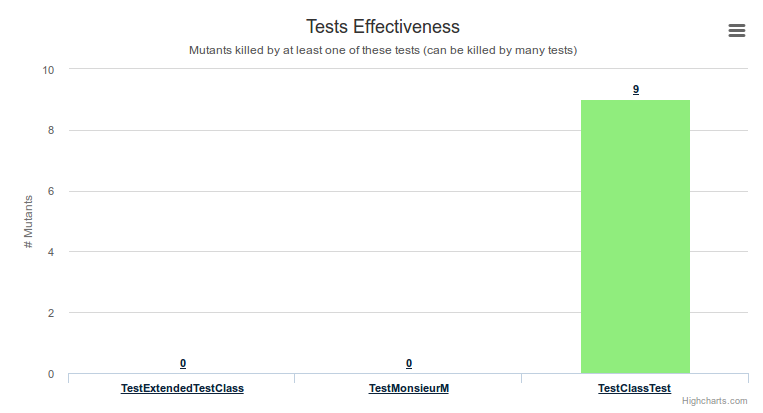
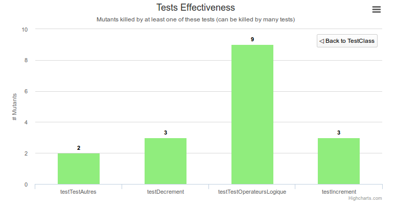
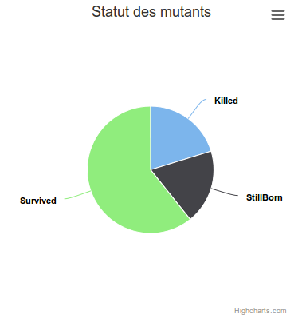
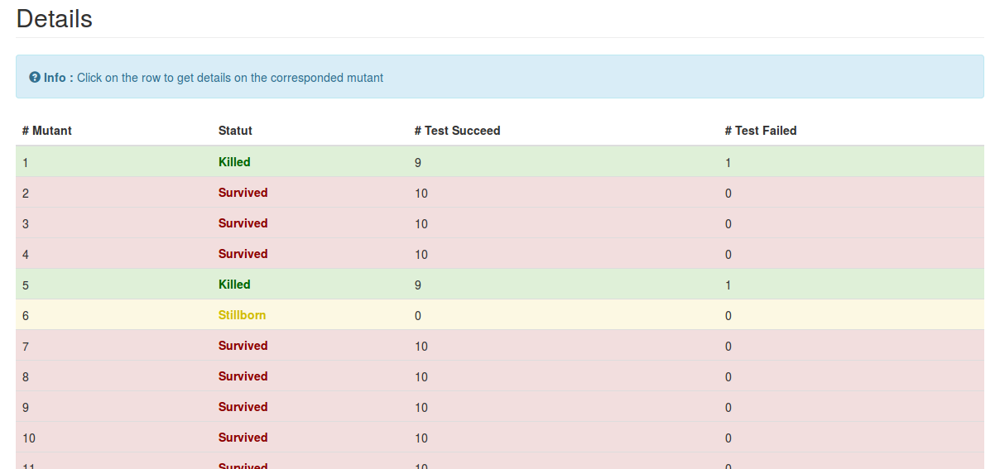

# Objectif du fichier HowTo

Vous permettre de comprendre comment utiliser notre framework par le biais d'un tutoriel pas à pas à suivre.

Une fois le framework correctement construit selon les indications du fichier **[Build.md](Build.md)** voici comment l'utiliser :

## 1. Exécution du framework

Pour lancer le framework, il faut exécuter le script **run_framework.sh** situé à la racine du projet.

## 2. Affichage du rapport

Après la fin de l'exécution du script, le rapport se trouve dans le module **HTMLGenerated** sous la forme de fichiers HTML.
Ouvrez le fichier **newindex.html** dans votre navigateur.
Le rapport est découpé en 3 zones principales :

* La première comporte un diagramme en bâtons représentant le nombre de mutants tués par classe de test :

Pour avoir plus de détails sur les tests de chaque classe, il est possible de cliquer sur la barre correspondant
à la classe souhaitée pour que le diagramme affiche les données souhaitées.

Pour revenir au diagramme plus général, il suffit de cliquer sur le bouton _Back to [class name]_.

* Une seconde zone contient un diagramme circulaire représentant la proportion de mutants tués, mort-nés et 
ayant survécus :

* La troisième zone correspond à la liste des mutants et leur statut après application du banc de test.

Pour chaque mutant est indiqué s'il a survécu, s'il a été tué ou s'il est mort-né ainsi que le nombre de 
tests passés et de tests échoués.

Un clic sur une ligne ouvre une fenêtre modale donnant plus d'information sur les tests soit le nom 
de chaque test, leur classe de test et leur statu (succès ou échec).

