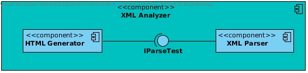
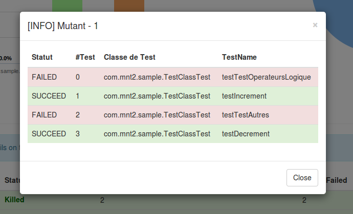

# Objectif du fichier Report

Donner une analyse critique de notre travail au travers de son architecture (Dev & Ops) en montrant ses forces et ses faiblesses

## I. Architecture

Notre projet est composé de 4 modules :

1. **Mutation** qui correspond au module disposant des mutations implémentées
2. **Sample** qui correspond au projet d'entrée, celui sur lequel sera appliqué les mutations
3. **xmlAnalyzer** qui correspond au module d'analyse des fichiers XML
4. **HTMLGenerated** qui correspond au module du rapport HTML (template etc...)

### I.1 module Mutation

Le module de mutation est le coeur du framework, c'est celui contenant toutes les mutateurs et les sélecteurs pouvant être
utilisés sur le module Sample.

### I.2 module Sample

Le module Sample est le projet sur lequel sera appliqué notre framework de mutation. Actuellement, nous utilisons notre 
projet Cobblestone implémenté dans le cadre de la matière OGL en SI3.

### I.3 module XMLAnalyzer

Maven test nous génère un rapport au format XML détaillant le bon déroulement ou non de tout les tests appliqués sur le projet.
Le module **XMLAnalyzer** se charge donc de **générer du contenu HTML** après avoir **parsé** ces fichiers. La conception de
ce module a été faite de telle manière que chaque objet réponde à un contrat (une interface) définie. Celà nous permet donc
de changer certains composants sans compromettre la santé du projet.

Nous utilisons une interface IGenerator pour le GenerateurHTML de sortes que l'on puisse générer de l'AngularJS (par exemple)
sans soucis. L'interface IParse définit que les objets qui transite entre le parseur et le Generateur sont des list d'objets
de TestReport. TestReport est notre propre structure de données contenant toutes les informations pertinente pour la génération
d'un rapport. Le Generateur HTML est écrit en Java. Nous avons utilisé notre propre template. C'est à dire que dans le fichier
index.html du module HTMLGenerated, se trouve des tags $NOM_TAG$ que l'on remplacera par le contenu souhaité. 

**Les Forces** : Ayant l'habitude des changement, nous avons consacré du temps à définir une architecture
modulaire de sortes à ce que l'on puisse changer chaque composant aisément. Nous voulions sur la fin passer à du AngularJS même si
par manque de temps et par priorité cela n'a pas été fait. Ce changement n'aurait pas couté énormement de ressources sur ce module (nous aurions
conçu un générateurJSON via la list de TestReport).
Par contre la création du site web en lui même aurait mis plus de temps (reprises des cours de l'an dernier etc.)

**Les faiblesses** : Nous avons perdu du temps en se préoccupant trop des performances. Nous avions un Parser en **SAX** qui est
compliqué à utiliser comparé à **JDOM**. Nous avons ensuite préféré passer à JDOM pour pouvoir prévoir les différentes améliorations du projet.
Nous avons donc perdu du temps sur ce point-ci. Concernant le générateur HTML, ayant une template "faite main" son architecture fait peur.
Nous réutilisons le générateur sur chaque fichier XML puis nous devons appeler une méthode pour pouvoir finaliser la génération de celui-ci.
Nous aurions préféré générer du JSON pour déléguer la génération du contenu au module HTMLGenerated en AngularJS mais cette
solution nous ait apparue trop tard.

**Les Faiblesses**
### I.4 module HTMLGenerated

Le but du rapport HTML étant de proposer des informations pertinentes sur le projet passé en entrée, nous avions du
réfléchir à certains points tels que l'ergonomie et les données exposées. 

Pour obtenir une Interface Homme Machine (IHM) fonctionnelle et tout de même plaisante nous avons utilisé le framework
Bootstrap pour structurer notre page. Ce framework nous a ainsi permis de gagner concernant le positionnement des objets
puisqu'il propose déjà une grille de 12 colonnes. Combiné aux graphes de HighChart, cela nous donne le rendu que nous voulions.
De plus certaines fonctionnalités de Bootstrap nous aurons été très utiles d'un point de vue **ergonomie**

Nous avons ainsi pu utiliser des fenetres modales pour afficher plus de données sur une seule page améliorant ainsi
l'expérience utilisateur.

Autrement, le site web reste généré statiquement c'est pourquoi l'architecture de celui-ci reste standard.

**Les Forces** : fait entièrement et correctement le job.
**Les Faiblesses** : les fenêtre modales sont elles aussi générées statiquement. Ce qui signifie que le contenu est en dur
dans le fichier html. Nous aurions préféré générer le contenu des fenêtres modales dynamiquement (avec des évènements onclick).
pour réduire la taille du fichier html (il serait plus lisible). La seule différence est la méthode, mais cela aurait même été plus
couteux en temps. Ce n'est donc une faiblesse mais aussi une force de l'avoir fait comme celà.

## Conclusion générale

Ce projet aura été très instructif, nous enseignant qu'il vaut mieux partir avec de la **dette technique** quelques fois 
(plugin Maven plutot qu'un script Bash).

Notre IHM est fonctionnelle apportant un réel atout à ce projet. Cependant nous n'avons pas pu y intégrer tout les fichiers
de configuration déjà créés que l'on voulait par manque de temps (description de la mutation etc.).

Notre projet génère actuellement 79 mutants ce qui est un nombre considérable et nous vous conseillons d'aller vous regarder
un épisode de série pendant ce temps. Notre projet ne passe actuellement pas à l'échelle ce qui est regrettable pour les
efforts mis en oeuvre.

En un mot le défaut de ce projet reste : Bash.

NB : Nous n'avons pas pu parraleliser le projet puisque l'on écrit dans generated-sources avant de compiler. Nous avions trouvé
une méthode pour résoudre le problème des compteurs (un compteur pour le processus et un pour les mutants) mais aucun pour ce
problème.