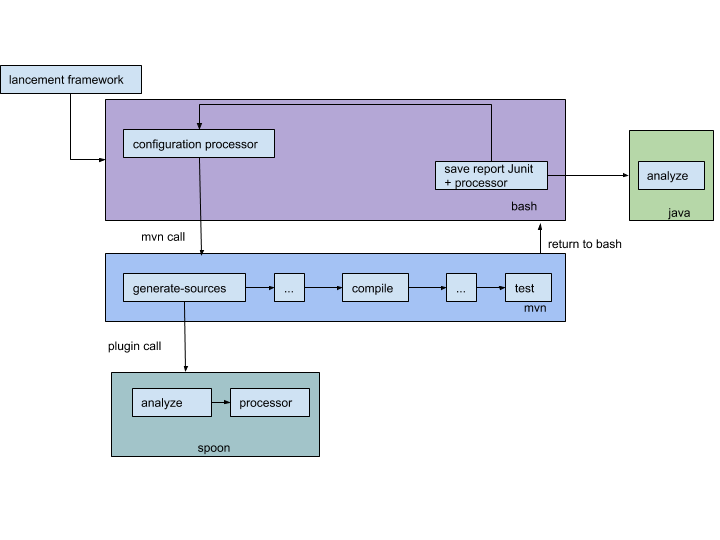

# Specifications du projet

## Sujet

Specifications.md : Document de description de votre framework (~3 pages)
Description de la chaine de build en positionnant les artefacts manipulés et les outils associés
Quelles mutations, où les appliquer, comment les appliquer ?

## Description de la chaine de build


Le système va être composé de 4 parties:
Un script bash qui va s’occuper de coordonner les différentes parties:
configurer le processor spoon pour générer les bons mutants
appeler maven pour lancer la chaine mutation -> compilation -> test
récupérer les rapports de JUnit et du processor pour générer le rapport plus tard
appeler l’outil d’analyse des rapports une fois la boucle de mutation et test terminée

un maven configuré pour appeler spoon à l’étape generate-source avec le processor configuré par le script bash
un processor qui va générer les mutations
un programme Java pour analyser les différents rapports et générer un rapport au format html pour l’utilisateur final

## Opérateurs de mutations applicables

#### ABS - Absolute value insertion
**Description :**  l’opérateur ABS ajoute une mise à la valeur absolue sur les variables applicables

**Exemple :** int b = 3 * a 
mutant ABS;  int b = 3* Math.abs(a);

#### AOR - Arithmetic operator replacement
**Description :**  l’opérateur AOR remplace un opérateur arithmétique ( *, +, -) par un autre opérateur arithmétique

#### LCR - Logical connector replacement
**Description : ** l’opérateur LCR remplace un opérateur logique ( AND, OR …) par un autre opérateur logique.

#### ROR - Relational operator replacement
**Description : ** l’opérateur ROR va remplacer un opérateur relationnel par un autre.

**Exemple :**
Code original : 	`if ( i < 10 ) …`
Mutant ROR : 		`if ( i >= 10 ) ...`

#### UOI - Unary operator insertion
**Description :** l’opérateur de mutation UOI va simplement insérer des opérateurs unaires dans le code

#### CRT (Compatible Reference Type replacement)
**Description :** Cette mutation a pour effet de remplacer un type déclaré par un autre type compatible. Cela permet de mettre en avant si les tests sont bien capables de distinguer deux types différents mais compatibles. Cela permet aussi de faire ressortir les différences entre ces types compatibles.

**Exemple :**
Classes :		
```
class T { … } 
interface K { … }
class S extends T implements K { … }
```

Code original:		`S s = new S();`

Mutations :		
```
T s = new S(); 
K s = new S();
```

#### ICE (class Instance Creation Expression changes)
**Description :** Cette mutation a pour effet de remplacer un type dynamique par un autre type compatible. Elle est très proche de la mutation CRT mais permet en plus de faire ressortir les problèmes lors de la création et de l’initialisation d’objets.

**Exemple :**
Classes :		
```
class S { … }
class U extends S { … }
```

Code original:		`S s = new S();`

Mutations :
```		
S s = new U();
S s = new S(1, “login”);
S s = new U(1, “login”, “Msg”);
```

#### AND - Argument Number Decrease 
**Description :** L’opérateur de mutation AND supprime un des paramètres lors de l’appel de la fonction. Ainsi, soit la fonction n’existe pas (et donc l’erreur est obligatoire) soit la fonction avec un paramètre de moins existe ce qui entraine l’appel d’une fonction différente. Le mutant devrait donc être lui aussi tué si les tests unitaires sont corrects, autrement, celà voudrait dire que le paramètre supprimé ne servait à rien. 

**Exemple :**
Code original : 	`Trace.trace(Trace.Event,this,sccsid);`
AND mutant 1 : 	`Trace.trace(this,sccsid); `
AND mutant 2 :	`Trace.trace(Trace.Event,sccsid);`


#### OMR - Overriding Method declaration Removal
 **Description :** Cet opérateur supprime la déclaration d’une méthode redéfinie (override) ainsi la méthode non redéfinie sera utilisée dans la suite du programme.
